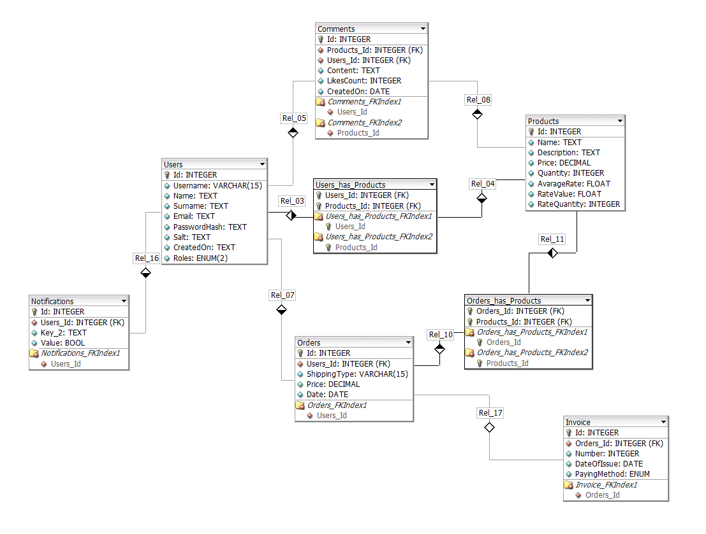

# eShopAPI
<b>Api provides:</b>
- User login/register with JWT authentication
- Adding, Listing, Removing, Changing products (Admin auth only)
- Adding, Finalizing, Listing products in your shopping cart
- Changing user password, username, deleting account.
- Sending Emails (check Application.SMTP)
- Newsletter Service (e.g. When product is added on stock)
- Order Finalizing confirmation via Email
- Response Caching via Redis (only on Products Controller)

## Tech:
- PostgreSQL
- Redis
- EntityFramework
- .NET 6.0

## Instalation:

1. Update DataBase

```bash
cd Application.Api
dotnet ef database update
```

2. Pull Redis image from Docker

```bash
docker pull redis
docker run -p 6379:6379 redis
```

## Database Schema:

